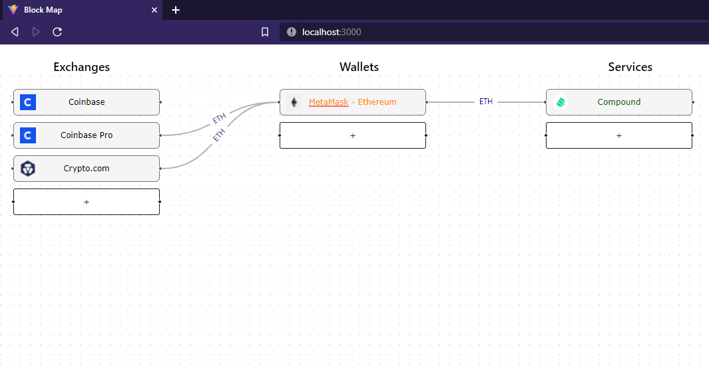

# Block Map

This project is trying to solve a problem about `discovery` in defi world.
As we know, there are so many platforms and services coming out every month.
And for a new user, it feels overwhelming when entering the defi world.
Users often have to document everything, sometimes forget how to transfer tokens in optimal ways, from which wallet to which services.

So I had this idea and developed this application to help users visualize and map out everything,
so that the user can see a bigger picture about the defi landscape and the tools they are using.

In this tool, currently, user can do different things like: adding a new box, give it a name, each box can be an Exchange, a Wallet, or a Service.
Then, user can connect from one box to another box easily by dragging and dropping arrows.
Users can also look at other people's diagram to discover services that people are using.
Learning more information about pools or farm APRs, how to transfer a token efficiently across those services.

Later on, we can also automate the initial diagram layout by querying user wallet's address
to get data about assets, balances, transactions, connections between addresses. Similar to the way
Zapper or Tin network work, but Zapper or Tin network only shows balances, not the whole diagram like this.

This application is useful in many scenarios like:
- Exploring or discovering what services people are really using.
- Can be used in education or tutorial about different services, how to transfer tokens, etc.
- Visualize user's portfolios to see balances, assets, transaction flows.

In the next version, there will be more integrations with more services for querying and visualizing more data.

